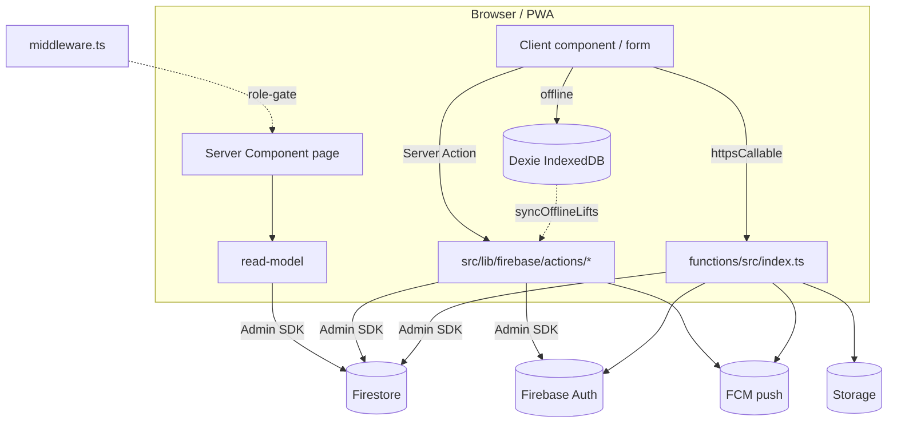
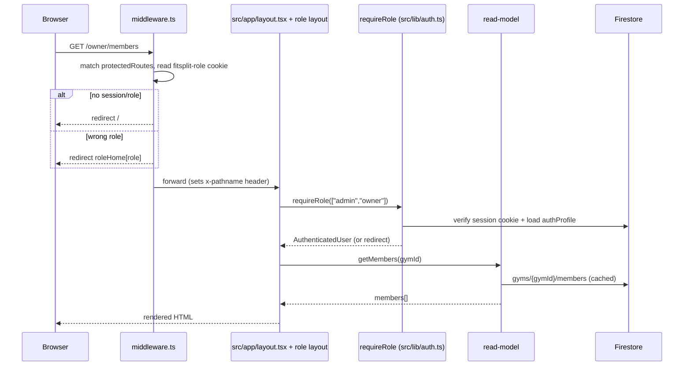

# 01 · ARCHITECTURE (Tier 1)

`Generated: 2026-06-05 · Commit: a0be3a8`

## 1. Product overview

**Current State:**
FitSplit is a multi-tenant gym-operations + personal-training platform. A single
deployment hosts many gyms; each gym is an isolated tenant under `gyms/{gymId}`. The pilot
tenant is **Sri Shakthi Hanuman Gym** (`shg`, `collections.ts:68`). Four roles —
`admin`, `owner`, `trainer`, `member` (`src/types/domain.ts:3`) — see different surfaces.

**Planned State (B2C + B2B Hybrid):**
FitSplit is evolving into a hybrid platform serving both direct-to-consumer and gym businesses:
- **Consumer Free & Consumer Pro:** Standalone users can self-coach, log workouts, and track macros.
- **Business:** Gym operators use the platform to manage rosters and deliver PT.
- **Gym Members:** Entitled users receive the full "Consumer Pro" feature set at no extra cost, paid for by their gym.

## 2. Tech stack (verified)

| Layer | Tech | Source |
|---|---|---|
| Framework | Next.js 15 App Router, React 19 | `package.json` deps `next ^15.3.1`, `react ^19.0.0` |
| Language | TypeScript | repo-wide `.ts/.tsx` |
| DB | Cloud Firestore (gym-scoped) | `src/lib/firebase/admin.ts`, `collections.ts` |
| Auth | Firebase Auth (username/phone + password + session cookies) | `src/lib/auth.ts` |
| Privileged backend | Cloud Functions v2, region `asia-south1` | `functions/src/index.ts:20` |
| Storage | Firebase Storage (gym logos) | `actions/gyms.ts:514-527`, `functions/src/index.ts:591-604` |
| Push | Firebase Cloud Messaging | `actions/shared.ts:616-663`, `functions/src/index.ts:263-279` |
| Client state | React state + Context (live workout session) | `src/components/member-coach-shell.tsx` |
| Offline | Dexie.js (IndexedDB) | `package.json` `dexie ^4` (`src/lib/offline-db.ts`) |
| Charts | Recharts (lazy via `next/dynamic`) | `package.json` `recharts ^3`; `*-chart.tsx` wrappers + `*.impl.tsx` |
| Calendar | Custom component (no FullCalendar dep) | `src/components/pt-calendar.tsx` |
| UI primitives | Radix UI | `package.json` `@radix-ui/*` |
| Animation | Framer Motion | `package.json` `framer-motion ^12` |
| Toasts | Sonner | `package.json` `sonner ^2` |
| Validation | Zod | `actions/validation.ts:1`, `package.json` `zod ^4` |
| Testing | Vitest | `vitest.config.ts` (include `src/lib/**/*.test.ts`); only 2 test files exist |

> Testing note: Vitest is configured but coverage is minimal — only
> `src/lib/__tests__/validation.test.ts` and `src/lib/__tests__/workout-utils.test.ts`. See
> [10_REFACTORING_ROADMAP](10_REFACTORING_ROADMAP.md).

## 3. Architecture pattern — no REST

There are **no `/api` route handlers**. Two data paths:

- **Reads:** Server Components import read-models from `src/lib/firebase/read-models/*`. Read-models
  use the Admin SDK and wrap results in `unstable_cache` (tag-based revalidation) and
  `react.cache` (per-request dedupe). Example: `read-models/members.ts:52-60`.
- **Writes:** two surfaces.
  1. **Server Actions** (`"use server"`, `src/lib/firebase/actions/*`) — invoked directly from
     client components / `<form action>`. They use the Admin SDK directly and call
     `requireRole`/`requireOwner` for authz. This is the **primary write path used by the UI**.
  2. **Cloud Functions callables** (`functions/src/index.ts`, wrapped by `src/lib/firebase/functions.ts`)
     — the canonical "privileged write" surface enforced by `allow:false` rules. Several mirror
     the Server Actions; not all are wired to UI yet. See
     [04_DATA_ACCESS_CATALOG](04_DATA_ACCESS_CATALOG.md).

## 4. Request lifecycle (page render)

## 5. Multi-tenancy model

**Current State:**
- Tenant root: `gyms/{gymId}` (`collections.ts:71-81`). Almost all domain data is a
  subcollection of the gym.
- **Dual storage (legacy):** most collections **also** exist at the root with a `gymId`
  field, written via `mirrorGymScopedRecord` / `mirrorProfileToGym`
  (`actions/shared.ts:315-415`, `functions/src/index.ts:235-261`). Read-models prefer the
  gym-scoped copy and fall back to root (e.g. `read-models/members.ts:31-38`).
- `authProfiles/{uid}` is the **root auth/session index** — lightweight, no gym-owned profile
  data (`collections.ts:6-8`). Custom claims `role`, `gymId`, `memberId` are set on the Auth
  user (`actions/shared.ts:149-153`) and consumed by Firestore rules (`firestore.rules:13-29`).

**Planned State (Consumer "Personal Gyms"):**
- To seamlessly support standalone consumers without breaking existing gym-scoped queries, each direct consumer will be provisioned their own "personal gym" (e.g., `gyms/personal-{uid}`).
- This effectively treats a consumer as the sole owner and member of a private tenant, reusing the exact same data structures.

## 6. Privileged-write enforcement

`firestore.rules` denies direct client writes for the sensitive collections and routes them
through Functions/Admin SDK:

- `members` create/delete `allow:false` (`firestore.rules:111`).
- `staff` create/update/delete `allow:false` (`firestore.rules:125`).
- `programAssignments` create/update/delete `allow:false` (`firestore.rules:193`).
- `activityEvents` all writes `allow:false` (`firestore.rules:201`).
- `memberships` writes `allow:false` (`firestore.rules:280`); `paymentRequests` update/delete
  `allow:false` (`firestore.rules:292`); `summaries`/`platformSummaries`/`archives`/`usernames`/
  `loginAttempts` writes `allow:false` (`firestore.rules:299,452,457,446,442`).

## 7. Cross-cutting services

- **Caching/invalidation.** Read-models tag entries `gym:{gymId}:{collection}`; actions call
  `revalidateGymTags`/`success(...)` to bust only touched tags (`actions/shared.ts:163-216`).
- **Archiving.** Deletes archive a snapshot to `archives/{id}` with 60-day retention before
  hard delete (`actions/shared.ts:231-313`, `functions/src/index.ts:281-319`); daily
  `purgeExpiredArchives` (`functions/src/index.ts:1752`).
- **Geofencing.** `validateGymGeofence` (Haversine) gates workout check-in
  (`actions/shared.ts:419-479`).
- **Push.** `sendPushToMember` reads `authProfiles.fcmToken`, never throws, prunes stale tokens
  (`actions/shared.ts:616-663`).
- **Scheduled jobs.** Membership expiry sweep, archive purge, PT reminders, abandoned-PT
  auto-cancel (`functions/src/index.ts:1688-1898`).

## 8. Deployment

Firebase App Hosting: `minInstances:0`, `maxInstances:10`, `concurrency:80`, `cpu:1`,
`memoryMiB:512` (`apphosting.yaml:3-8`) — matches README. Public Firebase client env vars are
committed in `apphosting.yaml:10-46` (expected for `NEXT_PUBLIC_*` keys). Cloud Functions deploy
to `asia-south1` (`functions/src/index.ts:20`). CSP/security headers configured in
`next.config.mjs` (per README §Security; not line-cited this pass).

## 9. Styling

CSS is modular under `src/app/styles/` loaded in numeric order. The directory contains the 21
numbered files plus `forms.css`, `member.css`, **and `ep-modal.css`** (the last is not in the
README CSS table — see [DISCREPANCIES](DISCREPANCIES.md)). Class-prefix conventions
(`odp2-`, `adm-`, `mhv-`, `m3d-`, `mcv-`, `pt-`, `lpd-`, `l1-`, `lp-modal-`, `nlist-`, `ntf-`)
are documented in `README.md` §Design System.
