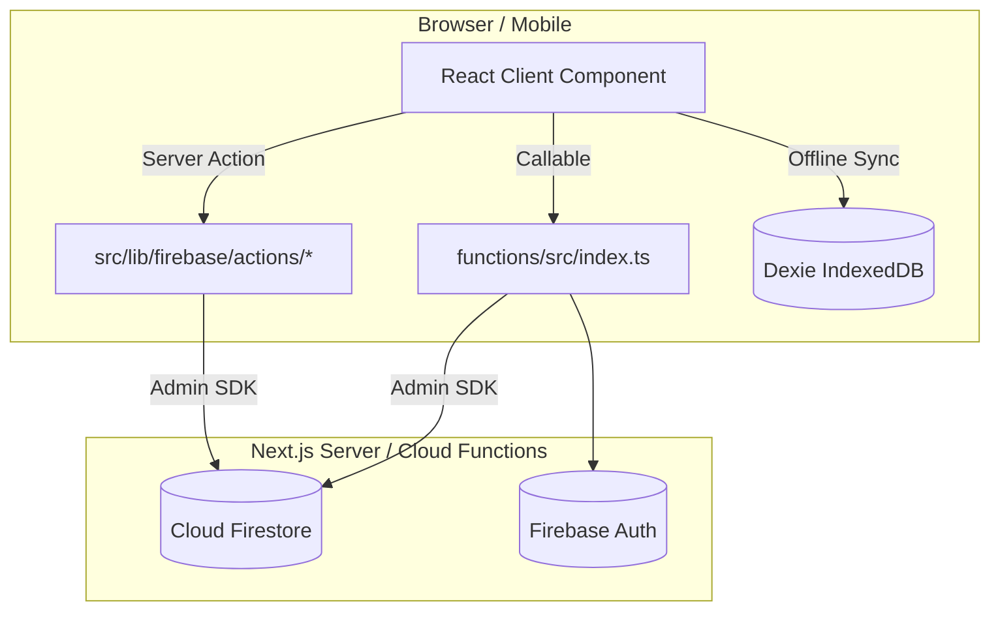

# 01 · System Architecture

`Last Updated: 2026-08-02 · FitSplit Monorepo`

---

## 1. Product Overview & System Architecture

FitSplit is a multi-tenant fitness operations platform combining personal training management, gym membership operations, and an interactive **Gym-Floor Workout Companion**.

* **Monorepo Architecture**:
  * `src/`: Next.js 16 App Router web & PWA application (`/member`, `/owner`, `/trainer`, `/admin`).
  * `mobile/`: Expo React Native mobile application for iOS & Android.
  * `packages/core/`: Shared TypeScript domain models, Zod validation schemas, and workout split calculation utilities (`@fitsplit/core`).
  * `functions/`: Firebase Cloud Functions v2 (Node.js 22 runtime) in region `asia-south1`.
  * `scripts/`: Multi-tenant database seeding, indexing, and administration tools.

---

## 2. Verified Technology Stack

| Layer | Technology | Usage & Purpose |
|---|---|---|
| **Web Framework** | Next.js 16 (App Router, React 19) | Server Components, Server Actions, PWA |
| **Mobile Framework** | Expo React Native (SDK 52) | Shared iOS & Android mobile application |
| **Shared Core Package** | `@fitsplit/core` | Shared domain logic, Zod validation, split calculations |
| **Database** | Firebase Cloud Firestore | Multi-tenant tenant isolation (`gyms/{gymId}`) |
| **Authentication** | Firebase Auth + Session Cookies | Multi-role auth (`admin`, `owner`, `trainer`, `member`) |
| **Backend Compute** | Firebase Cloud Functions v2 | Privileged operations, webhooks, transactions |
| **Offline Storage** | Dexie.js (IndexedDB) | Offline set logging sync for weak gym connections |
| **UI Primitives** | Radix UI + Vanilla CSS | Glassmorphism Obsidian design system (`#0D0D0E`, `#C8F135`) |
| **Testing** | Vitest | Unit testing for domain logic, billing, & workout utilities |

---

## 3. Data Flow & Authorization Pattern

FitSplit follows a **Server-Actions-First Architecture**:

* **Server Component Reads**: Rendered server-side using Admin SDK read-models (`src/lib/firebase/read-models/*`), utilizing React cache deduplication.
* **Server Action Writes**: Client components dispatch type-safe Server Actions (`src/lib/firebase/actions/*`) protected by role checks (`requireRole`, `requireOwner`).
* **Cloud Functions v2**: Handles transactional operations (e.g. gym creation, staff invite tokens, multi-collection cascades).
* **Proxy Middleware**: `src/proxy.ts` performs role-gating and security header enforcement prior to route handlers.

---

## 4. Authorization Matrix

| Role | Access Scope | Primary Actions |
|---|---|---|
| **`admin`** | Platform Super-Admin (`/admin`) | Manage all gyms, platform system settings, global exercise catalog |
| **`owner`** | Gym Owner / Operator (`/owner`) | Manage gym staff, member subscriptions, revenue reports, gym noticeboard |
| **`trainer`** | Certified PT / Staff (`/trainer`) | Assigned member roster, PT booking calendar, workout program builder |
| **`member`** | Gym Member / Lifter (`/member`) | Workout Companion, exercise video cues, exercise swaps, set logging |
