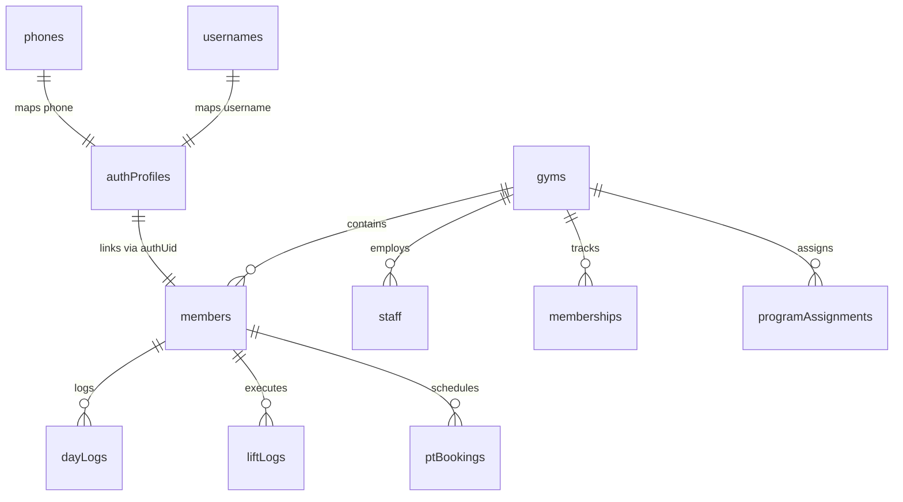

# 02 · Data Model & Firestore ERD

`Last Updated: 2026-08-02 · Multi-Tenant Firestore Schema`

---

## 1. Multi-Tenant Architecture Overview

FitSplit enforces strict tenant isolation using a gym-scoped subcollection hierarchy under `gyms/{gymId}` alongside optimized global lookup collections for fast authentication and search.

---

## 2. Global Lookup Collections

* **`authProfiles/{uid}`**: User identity profile mapping Firebase Auth `uid` to `{ email, authEmail, phone, fullName, role, staffType, gymId, defaultGymId, mustChangePassword, isActive }`.
* **`usernames/{usernameLower}`**: Fast 1-read document mapping lowercase usernames to `{ uid, gymId, role, memberId | staffId }`.
* **`phones/{cleanDigits}`**: Phone number lookup mapping 10-digit phone numbers to `{ uid, gymId, role, memberId }`.

---

## 3. Gym-Scoped Subcollections (`gyms/{gymId}`)

| Collection Path | Key Fields | Purpose |
|---|---|---|
| `gyms/{gymId}` | `id, name, slug, ownerId, location, logoUrl, status` | Primary gym tenant record |
| `gyms/{gymId}/members/{memberId}` | `id, fullName, username, email, phone, role, assignedTrainer, assignedProgramId, currentSplit, isActive` | Member profile record |
| `gyms/{gymId}/staff/{staffId}` | `id, fullName, username, email, role, staffType, isActive, mustChangePassword` | Staff/trainer profile record |
| `gyms/{gymId}/memberships/{membershipId}` | `id, memberId, planName, planType, status, startDate, endDate, amount` | Active member subscription |
| `gyms/{gymId}/programAssignments/{assignmentId}` | `id, memberId, programId, programName, splitType, status, assignedAt` | Assigned workout program |
| `gyms/{gymId}/exerciseCatalog/{exerciseId}` | `id, name, muscleGroup, videoUrl, gymVideoUrl, gymVideoSource, instructions` | Gym exercise catalog |

---

## 4. Member Activity Subcollections

* **`gyms/{gymId}/members/{memberId}/dayLogs/{logId}`**: Record of completed, skipped, or modified workout days.
* **`gyms/{gymId}/members/{memberId}/liftLogs/{logId}`**: Individual set logs containing `{ exerciseId, setIndex, weight, reps, rpe, loggedAt }`.
* **`gyms/{gymId}/members/{memberId}/ptBookings/{bookingId}`**: Personal training session bookings with assigned trainers.
