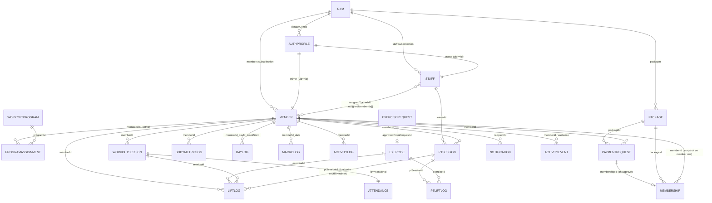

# 03 · FIRESTORE ERD (Tier 1)

`Generated: 2026-06-05 · Commit: c0e1f4b`

> Relationships derived from code (write sites, read mappers, `types/domain.ts`). References
> are by **field**, not Firestore document references. Most gym-scoped collections also have a
> root mirror (omitted from the diagram for clarity — see [02_DATA_DICTIONARY](02_DATA_DICTIONARY.md)).

## 1. Tenant containment (gym-first tree)

```mermaid
graph TD
  GYM["gyms/{gymId}"]
  GYM --> MEM["members/{memberId}"]
  GYM --> STAFF["staff/{userId}"]
  GYM --> EX["exerciseCatalog/{id}"]
  GYM --> EXR["exerciseRequests/{id}"]
  GYM --> WP["workoutPrograms/{id}"]
  GYM --> PA["programAssignments/{id}"]
  GYM --> LL["liftLogs/{id}"]
  GYM --> WS["workoutSessions/{id}"]
  GYM --> AT["attendanceRecords/{id}"]
  GYM --> BM["bodyMetricLogs/{id}"]
  GYM --> DL["dayLogs/{id}"]
  GYM --> ML["macroLogs/{id}"]
  GYM --> AL["activityLogs/{id}"]
  GYM --> AE["activityEvents/{id}"]
  GYM --> NOT["notifications/{id}"]
  GYM --> PTS["ptSessions/{id}"]
  GYM --> PTL["ptLiftLogs/{id}"]
  GYM --> PKG["packages/{id}"]
  GYM --> MSHIP["memberships/{id}"]
  GYM --> PR["paymentRequests/{id}"]
  GYM --> SUM["summaries/dashboard"]
  GYM --> CM["contactMessages/{id}"]
  GYM --> SL["siteLinks/{id}"]

  ROOT["root collections"] --> AP["authProfiles/{uid}"]
  ROOT --> USR["usernames/{name}"]
  ROOT --> ARC["archives/{id}"]
  ROOT --> PS["platformSummaries/main"]
  ROOT --> LA["loginAttempts/{id}"]
  ROOT --> GEX["exerciseCatalog (global)"]
  ROOT --> GWP["workoutPrograms (global)"]
```

## 2. Entity relationships (field references)

## 3. Key reference fields (verbatim)

| From | Field | To | Source |
|---|---|---|---|
| member | `assignedTrainerId` | staff (trainer) | `types/domain.ts:119`, `functions/src/index.ts:1335` |
| staff (trainer) | `assignedMemberIds[]` | member | `functions/src/index.ts:1298,1345` |
| programAssignment | `programId` | workoutProgram | `types/domain.ts:343` |
| programAssignment | `memberId` | member | `types/domain.ts:342` |
| liftLog | `exerciseId` / `sessionId` / `ptSessionId` | exercise / workoutSession / ptSession | `types/domain.ts:399-408` |
| ptSession | `trainerId` / `memberId` | staff / member | `types/domain.ts:615-617` |
| ptLiftLog | `ptSessionId` / `exerciseId` | ptSession / exercise | `types/domain.ts:649-651` |
| paymentRequest | `packageId` / `membershipId` | package / membership | `types/domain.ts:204,215` |
| membership | `packageId` / `paymentRequestId` | package / paymentRequest | `types/domain.ts:230,238` |
| notification | `recipientId` / `memberId` / `ptSessionId` | authProfile / member / ptSession | `types/domain.ts:350,377,379` |
| authProfile | `defaultGymId` | gym | `actions/shared.ts:336` |
| dayLog | `programId` / `dayId` | workoutProgram / WorkoutDay | `types/domain.ts:574-576` |

## 4. Denormalisation (intentional snapshots)

- Member doc carries `membershipStatus`, `membershipEndDate`, `currentPackageName` (from latest
  `Membership`) — written on approval (`functions/src/index.ts:1508-1510`, `actions/billing.ts:121-127`).
- Member doc carries `isPT`, `assignedTrainerId` (PT assignment) (`functions/src/index.ts:1334-1339`).
- Notification/activity carry `memberName`, `programTitle`, `trainerName` to avoid joins.
- `authProfiles` is itself a denormalised mirror of member/staff docs.
