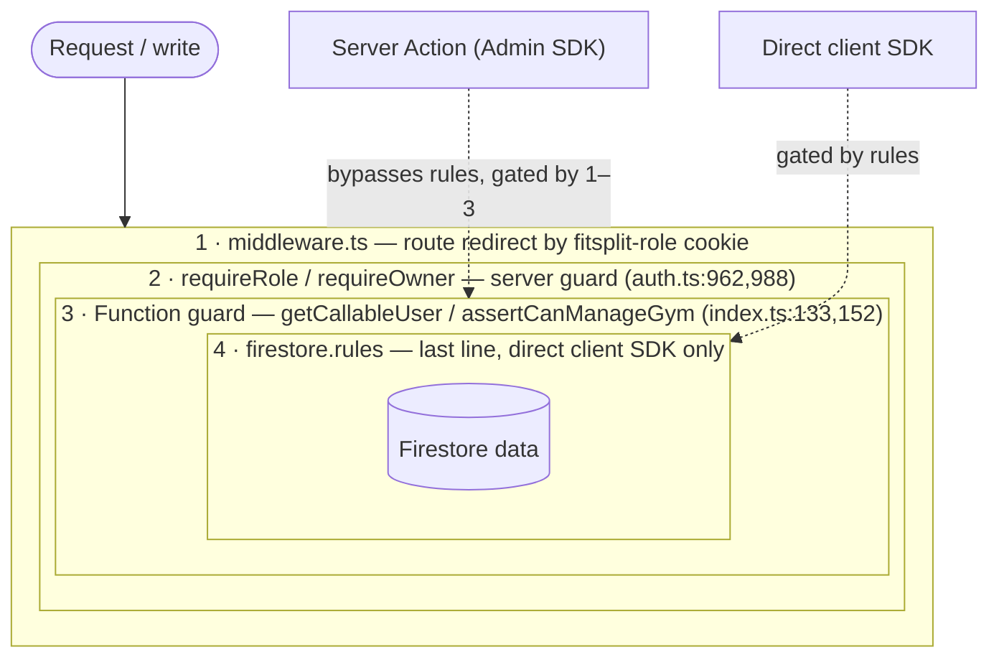

# 05 · AUTHORIZATION MATRIX (Tier 1)

`Generated: 2026-06-05 · Commit: a0be3a8`

> Roles × features. The **Enforced by** column names what actually blocks the action and where.
> Enforcement layers, outermost → innermost:
> 1. **middleware** (`middleware.ts`) — route-level redirect by `fitsplit-role` cookie.
> 2. **requireRole / requireOwner** (`src/lib/auth.ts:962,988`) — server-side guard in page/action.
> 3. **Function guard** (`getCallableUser`/`assertCanManageGym`, `functions/src/index.ts:133,152`).
> 4. **Firestore rules** (`firestore.rules`) — last line, for any direct client SDK write.

## Enforcement layers (outermost → innermost)

The nesting mirrors the order above: a request must clear each layer to reach the data.
Note the **two write paths** — Server Actions (the app's real path) use the Admin SDK and
**bypass Firestore rules**, so layers 1–3 are what protect them; rules (layer 4) only guard
*direct* client-SDK writes.

## Roles

**Current State:**
`admin | owner | trainer | member` (`src/types/domain.ts:3`). `owner` has a `staffType`
(`owner|trainer|staff`). Demo "trainers" are `role:"owner"` + `staffType:"trainer"`
(`src/lib/auth.ts:78-95`); `createStaffAccount`/`createTrainer` mint real `role:"trainer"` accounts
(`functions/src/index.ts:449,1291`). **As of 2026-06-05 a pure `role:"trainer"` account can log in**
— `toProfile`/cookie fallback accept `trainer` (`src/lib/auth.ts:306,893`).

**Planned State:**
- **Consumer role:** A new `consumer` role or variant with `plan: "free" | "pro"`.
- Consumers will only have access to their own "personal gym" data and will be explicitly blocked from any business/roster operations (e.g., viewing other members, delivering PT, creating packages).

## Route access (middleware.ts:3-11)

| Prefix | admin | owner | trainer | member | Source |
|---|:--:|:--:|:--:|:--:|---|
| `/admin` | ✅ | ❌ | ❌ | ❌ | `middleware.ts:4` |
| `/owner` | ✅ | ✅ | ❌* | ❌ | `middleware.ts:5` |
| `/trainer` | ❌ | ✅ | ✅ | ❌ | `middleware.ts:6` |
| `/member` | ❌ | ❌ | ❌ | ✅ | `middleware.ts:7` |
| `/profile`,`/activity` | ✅ | ✅ | ✅ | ✅ | `middleware.ts:8-9` |
| `/about`,`/privacy`,`/terms` | public | public | public | public | not in `middleware.ts` protectedRoutes (public) |

\* trainers (demo) are `role:"owner"`, so they pass `/owner` middleware; pages themselves call
`requireRole(["admin","owner"])`. A true `role:"trainer"` would be redirected from `/owner` to
`/trainer` (and, since 2026-06-05, can establish a session to reach it).

## Feature matrix

| Feature | admin | owner | trainer | member | Enforced by (file:line) |
|---|:--:|:--:|:--:|:--:|---|
| View all gyms | ✅ | ❌ | ❌ | ❌ | `requireRole[admin]` `src/app/admin/gyms/page.tsx`; rules `firestore.rules:103` |
| Create/update/delete gym | ✅ | update own only | ❌ | ❌ | CF admin-only `index.ts:485,541`; action `actions/gyms.ts:464`; rules `:104` |
| Create member | ✅ | ✅ | ❌ | ❌ | `requireOwner` `actions/members.ts:50`; CF `assertCanManageGym` `index.ts:349`; rules create `false` `:111` |
| Edit member profile | ✅ | ✅ | ❌ | self subset | `requireRole[admin,owner]` `actions/members.ts:178`; self via rules whitelist `:116` |
| Toggle/suspend member | ✅ | ✅ | ❌ | ❌ | `requireOwner` `actions/members.ts:584`; CF `:699` |
| Delete member | ✅ | ✅ | ❌ | ❌ | `requireOwner` `actions/members.ts:718`; CF `:1097` |
| Create staff / trainer | ✅ | ❌ | ❌ | ❌ | `requireRole[admin]` `actions/staff.ts:91`; CF admin-only `index.ts:431` |
| Update/delete staff | ✅ | ❌ | ❌ | ❌ | `requireRole[admin]` `actions/staff.ts:182,221`; rules `:125` |
| Reset member PIN / password | ✅ | ✅ (own gym) | ❌ | ❌ | `requireOwner`+belongs `actions/staff.ts:337,345`; CF `:718` |
| Assign program | ✅ | ✅ | ❌ (action gate) | ❌ | `requireRole[admin,owner]` `actions/programs.ts:93`; rules `false` `:193` |
| Create custom program | ✅ | ✅ | ❌ | ❌ | `requireOwner` `actions/programs.ts:432`; rules `:135` |
| Catalog: create/edit gym exercise | ✅ | ✅ | ❌ | ❌ | `requireOwner` `actions/exercises.ts:231,302`; rules `:130` |
| Catalog: edit GLOBAL exercise | ✅ | ❌ | ❌ | ❌ | admin check `actions/exercises.ts:322`; rules root `:330` |
| Request catalog exercise | ✅ | ✅ | ❌ | ❌ | `requireOwner` `actions/exercises.ts:35` |
| Approve/reject exercise request | ✅ | ❌ | ❌ | ❌ | `requireRole[admin]` `actions/exercises.ts:105,185` |
| Book/manage PT session | ✅ | ✅ | ✅ (as staff) | ❌ | `requireGymStaff` `actions/pt.ts:51`; rules staff `:253` |
| Log PT lift set | ✅ | ✅ | ✅ | ❌ | `requireGymStaff` `actions/pt.ts:199` |
| View PT session | ✅ | ✅ | ✅ | own only | rules gym-scoped `:249-252`; root `:424` |
| Assign trainer to member | ✅ | ✅ | ❌ | ❌ | `requireRole[admin,owner]` `actions/members.ts:683`; CF `:1314` |
| Trainer visibility setting | ✅ | ✅ | ❌ | ❌ | `requireOwner` `actions/billing.ts:191`; CF `:1360` |
| Package CRUD | ✅ | ✅ | ❌ | ❌ | `requireOwner` `actions/billing.ts:34`; rules `:271`; trainers no access `:272` |
| Submit payment request | ✅(on behalf) | ✅(on behalf) | ❌ | self | `requireRole[member]` `member-billing.ts:18`; CF `:1416` |
| Approve/reject payment | ✅ | ✅ | ❌ | ❌ | `requireOwner` `actions/billing.ts:90`; rules update `false` `:292` |
| Log own workout / metrics | ❌ | ❌ | ❌ | ✅ | `requireAuth`+`assertCanManageMember` `actions/progress.ts:73` |
| Coach note on member | ✅ | ✅ | ❌(action) | read-only | `requireRole[admin,owner]` `actions/progress.ts:228` |
| Geofenced check-in | ❌ | ❌ | ❌ | ✅ | `validateGymGeofence` `actions/progress.ts:556` |
| View contact inbox | ✅ | (gym staff via rules) | ❌ | ❌ | `requireRole[admin]` `src/app/admin/inbox`; rules `:233` |
| Platform/admin dashboard stats | ✅ | ❌ | ❌ | ❌ | CF admin-only `index.ts:1657` |
| Gym dashboard stats | ✅ | ✅ | ❌ | ❌ | CF manage-gym `index.ts:1601` |
| Mark own notifications read | ✅ | ✅ | (owner-role) | ✅ | `clearUserNotifications` `actions/notifications.ts:38-46`; rules `:152` |
| Submit contact message | public | public | public | public | rules create `true` `:232` |
| Export own data (DSAR) | ❌ | ❌ | ❌ | ✅ self | `requireRole[member]` `actions/privacy.ts` `exportMyData`; reads scoped to session `memberId` |
| Request account deletion (DSAR) | ❌ | ❌ | ❌ | ✅ self | `requireRole[member]` `actions/privacy.ts` `requestAccountDeletion`; notifies gym owner, who actions erasure |

## Firestore rule helper functions (firestore.rules:5-97)

| Helper | Meaning | Line |
|---|---|---|
| `role()` | token claim `role` or authProfile.role | `:13` |
| `currentGymId()` | token claim `gymId` or authProfile.defaultGymId | `:19` |
| `memberId()` | token claim `memberId` or uid | `:25` |
| `isAdmin()` | role == admin | `:31` |
| `isOwnerForGym(g)` | owner & gym matches | `:35` |
| `isTrainerForGym(g)` | trainer & gym matches | `:42` |
| `isStaffForGym(g)` | owner/trainer/staff & gym matches | `:49` |
| `isGymMember(g)` | member & gym matches | `:55` |
| `isMemberSelf(uid)` | member & memberId==uid | `:65` |
| `memberOwned(data)` | data.memberId == self | `:73` |
| `ownerScoped(data)` | owner of data.gymId | `:77` |
| `trainerCanReadMember(g)` | trainer of gym (coarse) | `:95` |

## Notable enforcement gaps (see [10_REFACTORING_ROADMAP](10_REFACTORING_ROADMAP.md))

- **Root PT collections**: Members are restricted to their own PT data at both the gym-scoped path (`firestore.rules:252`) and the root path (`firestore.rules:424,432`).
- **Trainer write breadth**: any gym staff (incl. trainers) can read/write any member's PT data
  for "cover" (`firestore.rules:253`, `actions/shared.ts:564-569`). Intentional but broad.
- ~~**macroLogs / activityLogs** have no root-level rule block~~ — **closed.** Explicit root
  `match` blocks now exist for `macroLogs`, `activityLogs`, and `memberships`
  (`firestore.rules`), scoped like root `liftLogs` (admin / owner-of-gym / member-self);
  writes on root `memberships` are `allow:false` (privileged). Previously these relied on
  implicit default-deny, inconsistent with their sibling root mirrors.
- ~~**Root `exerciseRequests`** readable/creatable by any `signedIn()` user~~ — **closed.**
  Root `/exerciseRequests` is now gym-scoped via `isGymUser(resource.data.gymId)` for read and
  `isGymUser(request.resource.data.gymId)` for create, matching the gym-scoped block. This
  removed a cross-tenant leak where a member of one gym could read/create another gym's requests.
- **Server Actions bypass Firestore rules** entirely (Admin SDK). Authz for the app's real write
  path is therefore `requireRole`/`requireOwner` + `assertMemberBelongsToCallerGym`, not rules.
  Rules only protect against direct client SDK access.
