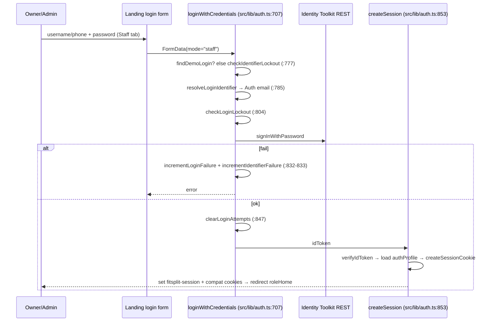
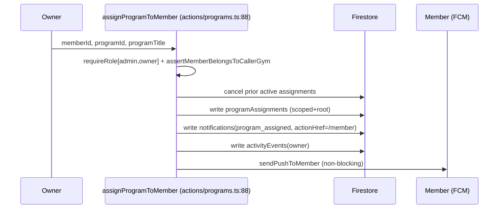
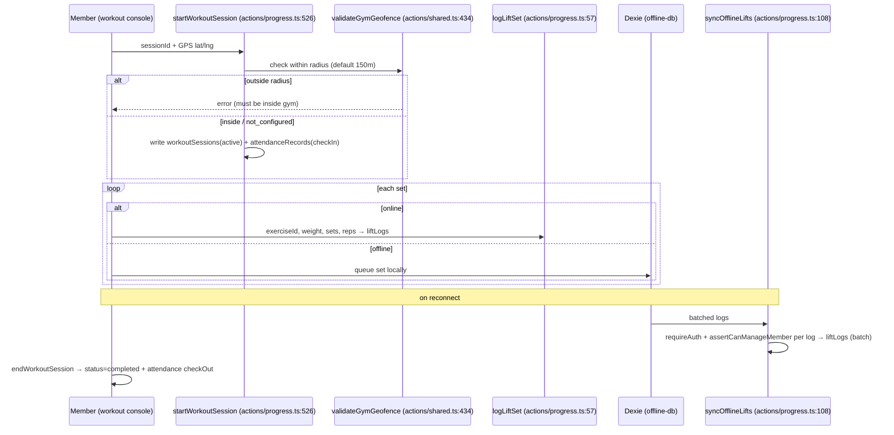
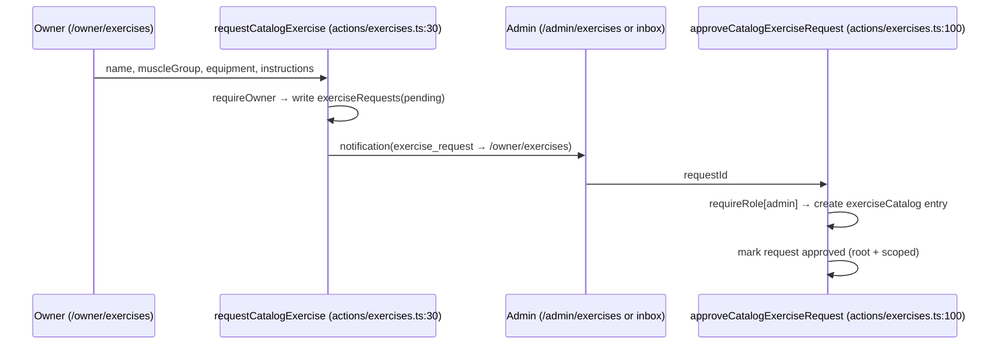

# 06 · USER JOURNEYS (Tier 1)

`Generated: 2026-06-05 · Commit: c0e1f4b`

> End-to-end flows. Each: Screen → Action/Function → Firestore write → Notification → Analytics.
> Citations point to the controlling code.

## 1. Staff login (username/phone + password)


Lockout: 5 fails → 15 min (`src/lib/auth.ts:509-510`); also enforced by `blockLockedAccounts`
(`functions/src/index.ts:1905`). New staff with `mustChangePassword` are forced to `/profile`
(`src/lib/auth.ts:972-978`).

## 2. Member login (PIN)

Same path, `mode="member"`. Firebase password = `pin-${PIN}` (`src/lib/auth.ts:812`). Identifier
intelligently resolves to either `username` or `phone` (bypassing emails entirely, email login is disabled for both staff and members). Demo members fall back
to compatibility-cookie session (`src/lib/auth.ts:772`).

## 3. Member creation (owner)

```mermaid
sequenceDiagram
  participant O as Owner (/owner/members)
  participant AC as createMemberProfile (actions/members.ts:45)
  participant AU as Firebase Auth
  participant FS as Firestore (txn)
  O->>AC: FormData(fullName,email,phone,username,goal)
  AC->>AC: requireOwner + ensurePrimaryWorkspace
  AC->>AU: upsertAuthUser(uid,pin-1234,role=member,claims)
  AC->>FS: runTransaction
  Note over FS: reserve usernames/{name}; write authProfiles; write gyms/{id}/members; memberCount++; activityEvents
  AC-->>O: success → revalidate "members" tag
```
CF equivalent `createMemberAccount` (`functions/src/index.ts:346`) rolls back the Auth user on
failure (`:419-425`). Notification: none to member; owner sees activity event.

## 4. Program assignment


**CF variant** (`functions/src/index.ts:744`) writes the assignment with
`sideEffectsMode:"trigger"`; `onProgramAssignmentCreated` (`:977`) then creates the
notification/activity/push idempotently (deterministic ids `program_assignment_*`).

## 5. Live workout logging (with offline/Dexie)


Day skip/modify → `logDayStatus` (`actions/progress.ts:267`, upsert id
`memberId_dayId_weekStart`) with optional makeup exercises; `updateMakeupStatus` to act on them.

## 6. PT booking → session → dual-write

```mermaid
sequenceDiagram
  participant T as Trainer/Owner
  participant BK as bookPTSession (actions/pt.ts:46)
  participant TR as onPTPlanCreated trigger (index.ts:1034)
  participant ST as startPTSession (actions/pt.ts:137)
  participant LG as logPTLiftSet (actions/pt.ts:194)
  participant CP as completePTSession (actions/pt.ts:283)
  participant M as Member
  T->>BK: memberId, trainerId, planStartDate, planDurationDays, plannedExercises
  BK->>BK: requireGymStaff; planEnd=start+duration-1
  BK->>BK: write ptSessions (scoped+root, sideEffectsMode=trigger)
  BK->>M: sendPushToMember (PT plan assigned)
  TR->>M: notification pt_session_booked + owner activity
  T->>ST: ptSessionId → status=active
  loop sets
    T->>LG: write ptLiftLogs + dual-write liftLogs(source=trainer, ptSessionId)
  end
  T->>CP: status=completed; notification pt_session_completed; FCM
```
Reschedule (`actions/pt.ts:435`) resets `notified24h/1h`. Reminders sent by
`notifyUpcomingPTSessions` (`index.ts:1765`). Abandoned active sessions auto-cancel after 6h
(`index.ts:1859`).

## 7. Membership / billing

```mermaid
sequenceDiagram
  participant M as Member (/member/membership)
  participant SUB as submitPaymentRequestAction (member-billing.ts:12)
  participant O as Owner (/owner/billing)
  participant AP as approvePaymentRequestAction (actions/billing.ts:85)
  participant FS as Firestore (batch)
  M->>SUB: packageId, method
  SUB->>SUB: requireRole[member]; guard duplicate pending
  SUB->>FS: write paymentRequests(pending)
  SUB->>O: notification(payment_request_pending → /owner/billing)
  O->>AP: requestId
  AP->>FS: create memberships(active, end=start+durationMonths)
  AP->>FS: update paymentRequests(approved, membershipId)
  AP->>FS: denormalise member.membershipStatus/EndDate/PackageName (+authProfiles)
  AP->>M: notification(membership_renewed → /member/membership)
```
Daily `processMembershipExpiries` (`index.ts:1688`) flips status to `expiring_soon`/`expired`
and notifies once per transition (warning threshold = gym `expiryWarningDays`, default 7, the
sweep uses a fixed 7-day window `:1690`).

## 8. Exercise request → approval



## 9. Notifications & push registration

```mermaid
sequenceDiagram
  participant U as Any signed-in user
  participant FC as FcmSetup (client)
  participant SV as saveFcmToken (actions/notifications.ts:70)
  participant SRC as Any action creating a member notification
  participant PUSH as sendPushToMember (actions/shared.ts:616)
  U->>FC: grant notification permission
  FC->>SV: token → authProfiles.fcmToken
  SRC->>PUSH: title, body, url
  PUSH->>PUSH: read authProfiles.fcmToken → messaging.send (webpush)
  Note over PUSH: never throws; prunes stale tokens
```
In-app: read-models `getOwner/Admin/MemberNotifications` feed the bell + `/owner/notifications`.
`clearUserNotifications` marks `readAt` for the caller's own notifications only.

## 10. Suspension / access flow

Owner toggles → `toggleMemberAccess` sets `isActive:false` on authProfiles + member + disables
Auth user (`actions/members.ts:579`). On next request, `getCurrentUser` finds inactive profile
and redirects to `/suspended` (`src/lib/auth.ts:935-943`). Admin `setGymStatus` cascades the flag to
every profile in the gym (`actions/gyms.ts:544`).
