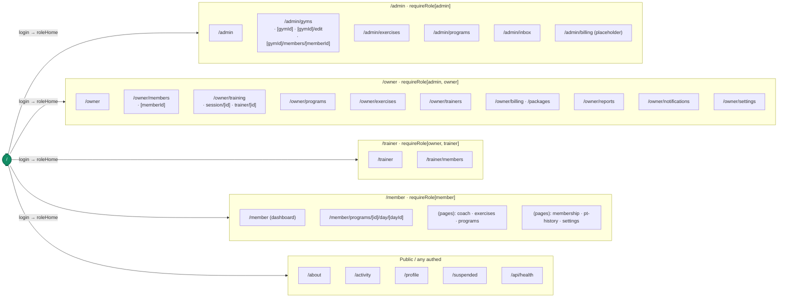

# 09 · SCREEN CATALOG (Tier 1)

`Generated: 2026-06-28 · Commit: fb6f244 · Updated for current App Router structure`

> Per route under `src/app/`: purpose, role required, key data (read-models/actions), collections
> touched. Role gate = the `requireRole/requireAuth` call in the page (or `src/proxy.ts` for
> routes that delegate). `(pages)` is a route group (shared layout, no URL segment).

## Route sitemap

Routes grouped by the proxy gate that protects them (`src/proxy.ts`). Wrong-role or
unauthenticated users are redirected to their `roleHome` or `/`.

> ⚠️ A true `role:"trainer"` account cannot establish a session today, so `/trainer` is reached
> by demo `role:"owner"` + `staffType:"trainer"` staff. See [DISCREPANCIES](DISCREPANCIES.md).

## Public / shared

| Route | File | Role | Purpose | Data |
|---|---|---|---|---|
| `/` | `src/app/page.tsx` | public | Landing page + login/contact modals | `loginWithCredentials`, `submitContactMessage` |
| `/about` | `src/app/about/page.tsx` | **public** | Static about (credits collaboration with Blume Labs) | — |
| `/privacy` | `src/app/privacy/page.tsx` | public | Privacy Policy (GDPR + CCPA/CPRA) | — |
| `/terms` | `src/app/terms/page.tsx` | public | Terms of Service (incl. health/fitness disclaimer) | — |
| `/api/health` | `src/app/api/health/route.ts` | public | No-store service health probe (`GET`/`HEAD`) | — |
| `/activity` | `src/app/activity/page.tsx` | `requireAuth` | Activity feed | `getActivityEvents` |
| `/profile` | `src/app/profile/page.tsx` | `requireAuth` | Account settings; staff password / PIN / admin email | `changeMemberPin`, `changeStaffPassword`, `changeAdminEmail`, `updateAdminDisplayName` |
| `/suspended` | `src/app/suspended/page.tsx` | (any) | Shown when profile inactive | — |

Root layout `src/app/layout.tsx` loads CSS in order, reads `getGymDetail` + `getActiveWorkoutSessions`
for the shell, reads the per-request CSP nonce (`x-nonce`), and renders topbar/nav (topbar hidden for
`/owner/*`). It also renders the **first-login consent gate** (`TermsConsentGate`) for any authed user
who hasn't yet accepted Terms + Privacy (`!currentUser.termsAcceptedAt` and no `fitsplit-terms-ack`
cookie) — accept (→ `acceptTerms`) to proceed, decline (→ `logoutUser`) to log out.

Root App Router special files:

| File | Purpose |
|---|---|
| `src/app/template.tsx` | Root route template wrapper (`display: contents`) for route-subtree lifecycle without adding layout chrome |
| `src/app/loading.tsx` | Shared full-page fitness loader |
| `src/app/error.tsx` | Root client error boundary using `AppStatusScreen` |
| `src/app/global-error.tsx` | Final root render error boundary; captures with Sentry and renders its own `<html>/<body>` |
| `src/app/not-found.tsx` | Shared FitSplit 404 screen using `AppStatusScreen` |

## Admin

| Route | File | Role | Purpose | Read-models / Actions | Collections |
|---|---|---|---|---|---|
| `/admin` | `src/app/admin/page.tsx` | `requireRole[admin]` | Platform overview | `getGymWorkspaces`, `getAdminNotifications` | gyms, notifications |
| `/admin` (layout) | `src/app/admin/layout.tsx` | `requireRole[admin]` | Admin shell + notifications | `getAdminNotifications` | notifications |
| `/admin/billing` | `src/app/admin/billing/page.tsx` | `requireRole[admin]` | Platform billing — **coming-soon placeholder** | — | — |
| `/admin/exercises` | `src/app/admin/exercises/page.tsx` | `requireRole[admin]` | Global exercise catalog mgmt + approve requests | exercise actions, `getExerciseCatalog`, `getPendingExerciseRequests` | exerciseCatalog (global), exerciseRequests |
| `/admin/gyms` | `src/app/admin/gyms/page.tsx` | `requireRole[admin]` | Gym list + create | `getGymWorkspaces`, `createGymWorkspace` | gyms |
| `/admin/gyms/[gymId]` | `src/app/admin/gyms/[gymId]/page.tsx` | `requireRole[admin]` | Gym detail + staff/owner mgmt | `getGymDetail`, `getMembers`, `getOwnersForGym` | gyms, members, staff |
| `/admin/gyms/[gymId]/edit` | `src/app/admin/gyms/[gymId]/edit/page.tsx` | `requireRole[admin]` | Edit gym details + logo | `getGymDetail`, `updateGymDetails`, `updateGymLogo` | gyms, Storage |
| `/admin/gyms/[gymId]/members/[memberId]` | `src/app/admin/gyms/[gymId]/members/[memberId]/page.tsx` | `requireRole[admin]` | Admin member detail — `adm-gym-hero` hero, 4-KPI strip, edit profile, member info rows, account access toggle + PIN reset, collapsible danger zone | `getMemberDetail`, `getGymDetail`, `updateMemberProfile`, `toggleMemberAccess`, `resetPassword`, `deleteMemberProfile` | authProfiles, gyms/members, phones |
| `/owner/training` | `src/app/owner/training/page.tsx` → `PTSessionsTable` client component | `requireRole[owner,admin]` | PT session hub — redesigned (2026-06-06): horizontal `ptd-kpibar` (3 KPIs), status-filter tabs with counts, search + trainer dropdown + list/calendar toggle, tabular list grouped by status with per-row actions (Activate/Console/View), calendar view | `getAllPTSessionsForGym`, `getMembers`, `getTrainersForGym`, `getExerciseCatalog`, `startPTSession` | gyms/ptSessions, ptSessions |
| `/admin/inbox` | `src/app/admin/inbox/page.tsx` | `requireRole[admin]` | Contact messages inbox | `getContactMessages`, `markContactMessageRead` | contactMessages |
| `/admin/programs` | `src/app/admin/programs/page.tsx` | `requireRole[admin]` | Admin program gallery | `getWorkoutPrograms`, program actions | workoutPrograms |

## Owner

Owner layout `src/app/owner/layout.tsx` (`requireRole[admin,owner]`) renders the fixed full-viewport
workspace shell (`odp2-*`).

| Route | File | Role | Purpose | Read-models / Actions | Collections |
|---|---|---|---|---|---|
| `/owner` | `src/app/owner/page.tsx` | `requireRole[admin,owner]` | Owner dashboard (KPIs, PT, activity) | `getAllPTSessionsForGym`, dashboard reads | summaries, ptSessions, members |
| `/owner/members` | `src/app/owner/members/page.tsx` | `requireRole[admin,owner]` | Hybrid member roster (action queue, KPIs, table) | `getMembers`, member/program/billing actions | members, programAssignments |
| `/owner/members/[memberId]` | `src/app/owner/members/[memberId]/page.tsx` | `requireRole[admin,owner]` | Member detail — program, PT, coach note, access | `getMemberWithProfile`, `updateCoachNote`, many member actions | members, liftLogs, ptSessions, memberships |
| `/owner/exercises` | `src/app/owner/exercises/page.tsx` | `requireRole[admin,owner]` | Gym exercise catalog + video | `getExerciseCatalog`, `createCatalogExercise` etc. | exerciseCatalog |
| `/owner/programs` | `src/app/owner/programs/page.tsx` | `requireRole[admin,owner]` | Program library + custom builder | `getWorkoutPrograms`, program actions | workoutPrograms, programAssignments |
| `/owner/training` | `src/app/owner/training/page.tsx` | `requireRole[admin,owner]` | PT hub (redesigned `adm-card`/`ptx-`): two-column manage view — controls rail + status-grouped plan lists; `?book=1` = focused booking form | `getAllPTSessionsForGym`, pt actions | ptSessions |
| `/owner/training/session/[ptSessionId]` | `…/session/[ptSessionId]/page.tsx` | `requireRole[admin,owner]` | Live PT session console | `getPTSessionDetail`, `getPTLiftLogsForSession`, `logPTLiftSet` | ptSessions, ptLiftLogs, liftLogs |
| `/owner/training/trainer/[trainerId]` | `…/trainer/[trainerId]/page.tsx` | `requireRole[admin,owner]` | Per-trainer schedule | `getPTSessionsForTrainer` | ptSessions |
| `/owner/trainers` | `src/app/owner/trainers/page.tsx` | `requireRole[admin,owner]` | Trainer roster + PT counts + add staff | `getTrainersForGym`, `getMembers`, `getAllPTSessionsForGym` | staff, members, ptSessions |
| `/owner/billing` | `src/app/owner/billing/page.tsx` | `requireRole[admin,owner]` | Payment requests approve/reject | `getPaymentRequests`, approve/reject actions | paymentRequests, memberships, members |
| `/owner/packages` | `src/app/owner/packages/page.tsx` | `requireRole[admin,owner]` | Membership package mgmt | `getPackages`, `savePackage`, `archivePackage` | packages |
| `/owner/reports` | `src/app/owner/reports/page.tsx` | `requireRole[admin,owner]` | KPIs, attendance trend, coverage, PT plans | `getRecentSessionCounts`, `getGymFloorLoadMap`, dashboard reads | workoutSessions, summaries |
| `/owner/notifications` | `src/app/owner/notifications/page.tsx` | `requireRole[admin,owner]` | Full notification centre (tabs, mark-all) | `getOwnerNotifications`, `clearUserNotifications` | notifications |
| `/owner/settings` | `src/app/owner/settings/page.tsx` | `requireRole[admin,owner]` | Gym details, logo, notices, trainer visibility | `getGymDetail`, `updateGymDetails`, `updateGymLogo`, notice/visibility actions | gyms |

## Member

Member dashboard `src/app/member/page.tsx` (`requireRole[member]`) = `MemberCoachShell` (workout
console, progress, wellness). Sub-pages share `src/app/member/(pages)/layout.tsx` (`requireRole[member]`,
loads `getGymDetail`, `getMemberWithProfile`, `MemberSubSidebar`).

| Route | File | Purpose | Read-models / Actions | Collections |
|---|---|---|---|---|
| `/member` | `src/app/member/page.tsx` | Dashboard: live workout console, progress, wellness | `getWorkoutPrograms`, `get*ForMember`, progress actions | liftLogs, workoutSessions, dayLogs, bodyMetricLogs, macroLogs, activityLogs, programAssignments |
| `/member/programs/[id]/day/[dayId]` | `…/programs/[id]/day/[dayId]/page.tsx` | A single program day (log sets) | program + progress reads/actions | liftLogs, dayLogs, workoutSessions |
| `/member/coach` | `src/app/member/(pages)/coach/page.tsx` | Trainer conversation + coach note | `getMemberWithProfile` | members |
| `/member/exercises` | `src/app/member/(pages)/exercises/page.tsx` | Read-only exercise catalog | `getExerciseCatalog` | exerciseCatalog |
| `/member/programs` | `src/app/member/(pages)/programs/page.tsx` | Read-only program library | `getWorkoutPrograms` | workoutPrograms |
| `/member/membership` | `src/app/member/(pages)/membership/page.tsx` | Membership status, request package, payment history | `getPackages`, `getMembershipsForMember`, `getPaymentRequestsForMember`, `submitPaymentRequestAction` | packages, memberships, paymentRequests |
| `/member/pt-history` | `src/app/member/(pages)/pt-history/page.tsx` | PT session history + logged sets | `getPTSessionsForMember`, `getPTLiftLogsForSession` | ptSessions, ptLiftLogs |
| `/member/settings` | `src/app/member/(pages)/settings/page.tsx` | Units, PIN change, notifications, **Privacy & your data** (DSAR: export JSON + request deletion) | `getMemberWithProfile`, `changeMemberPin`, `saveFcmToken`, `exportMyData`, `requestAccountDeletion` | members, authProfiles, notifications |

## Trainer

| Route | File | Role | Purpose | Read-models | Collections |
|---|---|---|---|---|---|
| `/trainer` | `src/app/trainer/page.tsx` | `requireRole[owner,trainer]` | Trainer PT schedule | `getPTSessionsForTrainer` (via gym) | ptSessions |
| `/trainer/members` | `src/app/trainer/members/page.tsx` | `requireRole[owner,trainer]` | Trainer's visible members | `getGymDetail`, `getMembersForTrainer` | members |

> `/trainer` routes are gated `requireRole[owner,trainer]`. As of 2026-06-05 a true `role:"trainer"`
> account **can** establish a session (`src/lib/auth.ts:306,893` accept `trainer`). Demo trainers are
> still `role:"owner"` + `staffType:"trainer"` in seed data. (Was a [DISCREPANCIES](DISCREPANCIES.md) item.)

## Loading / error boundaries

Each role area has `loading.tsx` skeletons and `error.tsx` boundaries. Root/admin/owner/member error
boundaries share `src/components/app-status-screen.tsx`; `src/app/not-found.tsx` uses the same status
screen. These are UI-only and touch no collections.

## Entry / exit conditions (common)

- **Entry:** `src/proxy.ts` redirects unauthenticated users to `/`; wrong-role users to their
  `roleHome`.
- **Exit:** inactive profile → `/suspended` (`src/lib/auth.ts:940`); new staff → `/profile?forceChange=1`
  (`src/lib/auth.ts:976`); `logoutUser` clears cookies → `/`.
