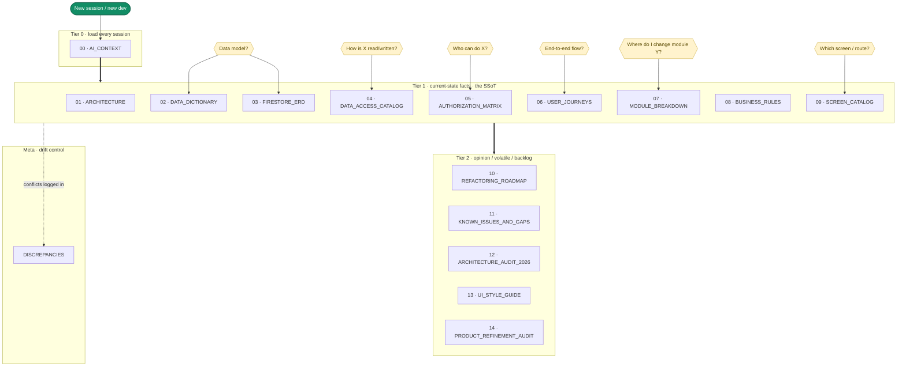

# FitSplit Technical Knowledge Repository — Index

`Generated: 2026-06-28 · Commit: fb6f244 · Updated for current App Router structure`

> **Purpose.** This `/docs` tree is the single source of truth (SSoT) for the FitSplit
> codebase. It is built so a new developer (or AI session) can understand and modify
> the app **module by module** without reading the whole repo. Load only the tier/doc
> relevant to your task.
>
> **Ground truth = code.** Every factual claim carries a `path/to/file.ts:LINE`
> citation. Where the legacy `README.md` / `FIRESTORE_STRUCTURE.md` disagree with
> code, **code wins** and the conflict is logged in [`DISCREPANCIES.md`](DISCREPANCIES.md).
> Anything that could not be traced to code is marked `⚠️ UNVERIFIED`.

---

## Documentation map

How the docs relate, by tier and reading order. Nodes are clickable on GitHub.

---

## Tier map

| Tier | When loaded | Files |
|---|---|---|
| **Tier 0** | Every session (keep tiny, ~8k tokens) | `00_AI_CONTEXT.md` |
| **Tier 1** | Current-state facts (the SSoT body) | `01`–`09` |
| **Tier 2** | Opinion / volatile / backlog | `10`–`19` |
| **Meta** | Navigation + drift control | `_INDEX.md`, `DISCREPANCIES.md` |

## File directory

| File | Tier | One-line description |
|---|---|---|
| [00_AI_CONTEXT.md](00_AI_CONTEXT.md) | 0 | Condensed everything — load this every session. |
| [01_ARCHITECTURE.md](01_ARCHITECTURE.md) | 1 | System + product overview, request/data-flow, Mermaid diagrams. |
| [02_DATA_DICTIONARY.md](02_DATA_DICTIONARY.md) | 1 | One entry per Firestore collection. Supersedes `FIRESTORE_STRUCTURE.md`. |
| [03_FIRESTORE_ERD.md](03_FIRESTORE_ERD.md) | 1 | Mermaid ER diagrams of collections and relationships. |
| [04_DATA_ACCESS_CATALOG.md](04_DATA_ACCESS_CATALOG.md) | 1 | Every Server Action, Cloud Function, and read-model. |
| [05_AUTHORIZATION_MATRIX.md](05_AUTHORIZATION_MATRIX.md) | 1 | Roles × features with the enforcement column. |
| [06_USER_JOURNEYS.md](06_USER_JOURNEYS.md) | 1 | End-to-end flows per role, Mermaid sequence diagrams. |
| [07_MODULE_BREAKDOWN.md](07_MODULE_BREAKDOWN.md) | 1 | Module-by-module refactor roadmap table. |
| [08_BUSINESS_RULES.md](08_BUSINESS_RULES.md) | 1 | Every business rule extracted from code. |
| [09_SCREEN_CATALOG.md](09_SCREEN_CATALOG.md) | 1 | Per route: purpose, data, role, collections. |
| [10_REFACTORING_ROADMAP.md](10_REFACTORING_ROADMAP.md) | 2 | Dated point-in-time opinion: debt, risks, dead code. |
| [11_KNOWN_ISSUES_AND_GAPS.md](11_KNOWN_ISSUES_AND_GAPS.md) | 2 | Aggregated backlog of bugs, incomplete functionalities, and tech debt. |
| [12_ARCHITECTURE_AUDIT_2026.md](12_ARCHITECTURE_AUDIT_2026.md) | 2 | Firestore cost, backend architecture, and B2B2C scaling audit. |
| [12_UI_STYLE_GUIDE.md](12_UI_STYLE_GUIDE.md) | 2 | Complete design system, tokens, CSS architecture, and layout paradigms. |
| [14_PRODUCT_REFINEMENT_AUDIT_2026-07-02.md](14_PRODUCT_REFINEMENT_AUDIT_2026-07-02.md) | 2 | Product/UI refinement audit covering orphaned flows, landing-page debt, and cleanup priorities. |
| [15_UNUSED_CODE_CI_GUARDRAIL_2026-07-02.md](15_UNUSED_CODE_CI_GUARDRAIL_2026-07-02.md) | 2 | knip-based unused-files/deps CI workflow. |
| [16_FABLE_AUDIT_2026-07-05.md](16_FABLE_AUDIT_2026-07-05.md) | 2 | Go-live readiness audit: consolidated defects (F1–F5), completed task plan T1–T6, validation evidence, and human go-live checklist. |
| [17_ROOT_BACKFILL_RUNBOOK.md](17_ROOT_BACKFILL_RUNBOOK.md) | 2 | Operational runbook for `scripts/backfill-root-to-gym.mjs` — copies legacy root-collection data into `gyms/{gymId}/...` ahead of root-collection archival. |
| [18_DEMO_USERS.md](18_DEMO_USERS.md) | 2 | Every demo login on live Firestore (3 gyms × 20 members + staff), PINs/passwords, membership states, and the E2E scenario each account covers. Seeded by `npm run seed:demo-gyms`. |
| [19_OWNER_DETAIL_REPORTS_REDESIGN_PLAN.md](19_OWNER_DETAIL_REPORTS_REDESIGN_PLAN.md) | 2 | Implementation-ready redesign plan for `/owner/members/[memberId]` (missing `mpd-`/`tpp-` stylesheet) and `/owner/reports` (`rpt-` class system, actionable KPIs). |
| [20_EXPO_MIGRATION_PLAN.md](20_EXPO_MIGRATION_PLAN.md) | 2 | Design plan for a React Native/Expo mobile app: reuse inventory, auth-reuse strategy (Firebase Auth + custom claims port directly, session cookies don't), new API surface needed, phased rollout. Member app is now built (`mobile/`). |
| [21_MOBILE_GO_LIVE_CHECKLIST.md](21_MOBILE_GO_LIVE_CHECKLIST.md) | 2 | Honest go-live checklist for the Expo member app: what's engineering-complete vs. the human-gated steps (accounts, branded assets, iOS device test, EAS build/submit, offline-sync + push still to build). |
| [DISCREPANCIES.md](DISCREPANCIES.md) | Meta | README/code conflicts + dead/orphaned references. |

---

## Maintenance protocol

- **Stamp.** Every doc header carries a generation/review date and, when regenerated, the
  relevant git short hash.
- **Regenerate-one.** Each doc can be rebuilt in isolation. To rebuild a single doc,
  re-run the original generation prompt scoped to that doc only — e.g.
  *"regenerate `02_DATA_DICTIONARY.md` only against current code"*. A change to one
  collection does not force a full re-analysis.
- **Drift rule.** Any PR that changes a **collection, action, function, role, or route**
  MUST update the matching Tier-0/Tier-1 doc in the same PR. Tier-2
  (`10_REFACTORING_ROADMAP.md`) is regenerated on demand and is never trusted as current.
- **Handoff.** This repo is co-developed by **Claude + Codex**; significant changes also
  go in `PROJECT_HANDOFF.md` (repo root).

---

## Self-audit results

See the bottom of this file. Structural audit refreshed `2026-06-28` against commit `fb6f244`.

### 1. Coverage checklist

- **Collections** — all keys in `src/lib/firebase/collections.ts:1-64` and every `match`
  block in `firestore.rules` appear in `02_DATA_DICTIONARY.md`. ✅
- **Cloud Functions** — all 33 exported functions in `functions/src/index.ts`
  (grep `^export const … = (onCall|onDocument|onSchedule|beforeUserSignedIn)`) appear in
  `04_DATA_ACCESS_CATALOG.md`. ✅
- **Server Actions** — every exported function in `src/lib/firebase/actions/*` appears in `04`. ✅
- **Read-models** — every exported function in `src/lib/firebase/read-models/*` appears in `04`. ✅
- **Routes** — every page route under `src/app/**/page.tsx`, the root App Router special files,
  and the `/api/health` route handler appear in `09_SCREEN_CATALOG.md`. ✅

### 2. Citation spot-check (10 random)

| # | Citation | Claim | Result |
|---|---|---|---|
| 1 | `src/lib/auth.ts:509-510` | `MAX_FAILED_ATTEMPTS = 5`, `LOCKOUT_MINUTES = 15` | PASS |
| 2 | `src/lib/auth.ts:19` | 2-hour short session cookie | PASS |
| 3 | `functions/src/index.ts:1862` | 6-hour abandoned PT cutoff | PASS |
| 4 | `src/lib/firebase/actions/shared.ts:232` | 60-day archive retention | PASS |
| 5 | `src/lib/firebase/actions/shared.ts:452-454` | default geofence radius 150m | PASS |
| 6 | `src/lib/firebase/actions/pt.ts:81` | PT plan end = start + duration − 1 | PASS |
| 7 | `firestore.rules:111` | `members` create/delete = `false` | PASS |
| 8 | `src/types/domain.ts:13` | `TrainerMemberVisibility` union | PASS |
| 9 | `src/lib/firebase/actions/members.ts:74` | member default password `pin-1234` | PASS |
| 10 | `src/lib/auth.ts:306` | `toProfile` rejects role `trainer` | PASS |

### 3. Tier-0 size

`00_AI_CONTEXT.md` is within the ~8k token cap (links out rather than duplicating detail). ✅
